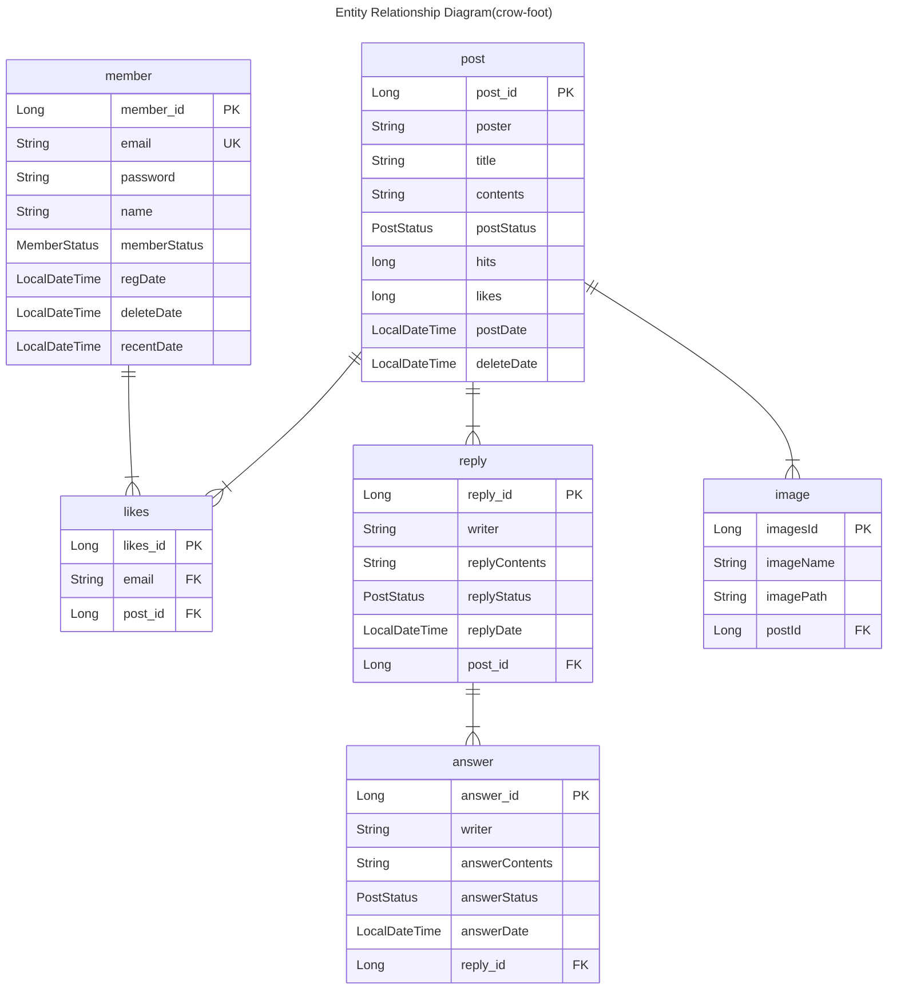

# 게시판

# 1-1. Github

1. 백엔드: https://github.com/kwagi/board
2. 클라이언트: https://github.com/kwagi/client

## 1-2. 사용한 프레임워크

1. Spring: 백엔드 로직을 구성할때 사용했습니다.
2. Svelte: 클라이언트 화면을 구성할때 사용했습니다.
3. docker: 서버에 배포할때 사용했습니다.

## 1-3. 구현기능

- 회원가입
- 로그인
- 로그아웃
- 회원탈퇴
- 로그인 세션유지
- 비밀번호 변경
- 글 작성(사진여러장 첨부가능)
- 작성게시글 보기
- 게시글 삭제
- 게시글에 좋아요누르기
- 게시글에 댓글달기
- 댓글삭제
- 댓글에 답글달기
- 답글삭제

# 2-1. ERD

# 3. 테스트

JUnit5를 활용한 단위테스트를 했습니다.

# 4. 배포

서버는 구글 GCP를 사용했습니다. docker compose를 사용해서 어플리케이션들을 일괄시작하도록 하였습니다.